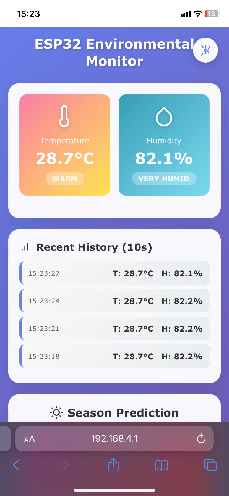
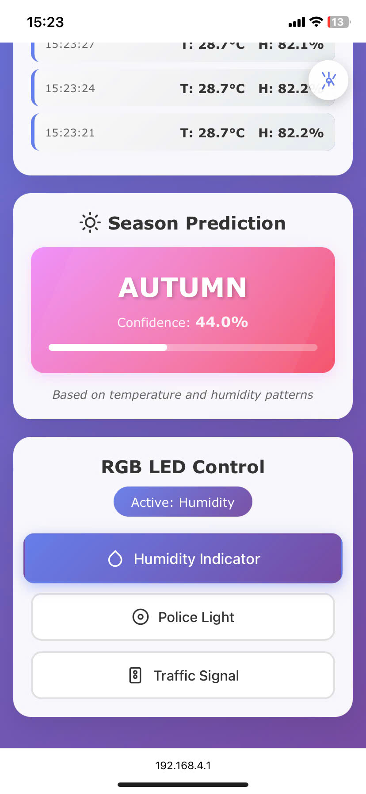

# ESP32-S3 IoT Environmental Monitoring System with TinyML

This project implements a comprehensive IoT environmental monitoring system using the ESP32-S3 microcontroller. The system integrates multiple tasks running concurrently under FreeRTOS, including sensor data acquisition, LED visualization, web server functionality, and on-device machine learning for season prediction.

## Features

- Real-time temperature and humidity monitoring using DHT20 sensor
- Multi-tasking environment powered by FreeRTOS
- Visual feedback through LED and NeoPixel indicators
- Web-based dashboard for monitoring and control
- TinyML implementation for season prediction
- Thread-safe resource management with mutexes and semaphores

## System Architecture

The system is composed of six main tasks:

### Task 0: Data Acquisition
- Periodic reading of temperature and humidity data from DHT20 sensor
- Thread-safe data storage using mutexes
- Reliable sensor communication implementation

### Task 1 & 2: Visual Feedback
- LED status indicator for system operation
- NeoPixel display for environmental condition visualization
- Event-driven response to sensor data changes

### Task 3 & 4: Web Server
- Real-time data display through web interface
- Remote system control capabilities
- User-friendly dashboard for monitoring
- WebSocket implementation for live updates




### Task 5: TinyML Implementation
- On-device season prediction using sensor data
- TensorFlow/Keras model deployment
- Real-time inference capabilities

## Technical Implementation

### Concurrency Management
- FreeRTOS task scheduling
- Mutex implementation for shared resource protection
- Semaphore usage for task synchronization
- Priority-based task execution

### Hardware Requirements
- ESP32-S3 microcontroller
- DHT20 temperature and humidity sensor
- Standard LED
- NeoPixel RGB LED
- I2C connection for sensor communication

### Software Dependencies
- PlatformIO development environment
- FreeRTOS
- TensorFlow Lite for microcontrollers
- WebSocket library for real-time communication
- DHT20 sensor library

## Getting Started

1. Clone the repository
2. Open the project in PlatformIO
3. Install required libraries through PlatformIO Library Manager
4. Configure your network settings in `include/global.h`
5. Build and upload the project to your ESP32-S3

## Project Structure
```
├── include/
│   ├── dht_anomaly_model.h    # TinyML model header
│   ├── global.h               # Global configurations
│   ├── led_blinky.h          # LED control functions
│   ├── mainserver.h          # Web server implementation
│   ├── neo_blinky.h          # NeoPixel control
│   ├── sensor_reader.h       # DHT20 sensor interface
│   ├── temp_humi_monitor.h   # Temperature monitoring
│   └── tinyml.h              # ML inference implementation
├── src/
│   ├── main.cpp              # Main application entry
│   ├── global.cpp            # Global variables
│   ├── led_blinky.cpp        # LED control implementation
│   ├── mainserver.cpp        # Server implementation
│   ├── neo_blinky.cpp        # NeoPixel implementation
│   ├── sensor_reader.cpp     # Sensor reading logic
│   ├── temp_humi_monitor.cpp # Monitor implementation
│   └── tinyml.cpp            # ML inference logic
└── lib/
    ├── DHT20/               # DHT20 sensor library
    └── LCD/                 # LCD display library
```

## Web Interface

The web interface provides two main functionalities:
1. **Monitoring Dashboard**: Real-time display of temperature and humidity data
2. **Control Panel**: Interface for controlling NeoPixel modes and system settings

Note: Please add your dashboard screenshots to the `images` folder as:
- `dashboard_monitoring.png`
- `dashboard_control.png`

## Contributing

Feel free to contribute to this project by submitting issues or pull requests.

## License

This project is licensed under the MIT License - see the LICENSE file for details.
